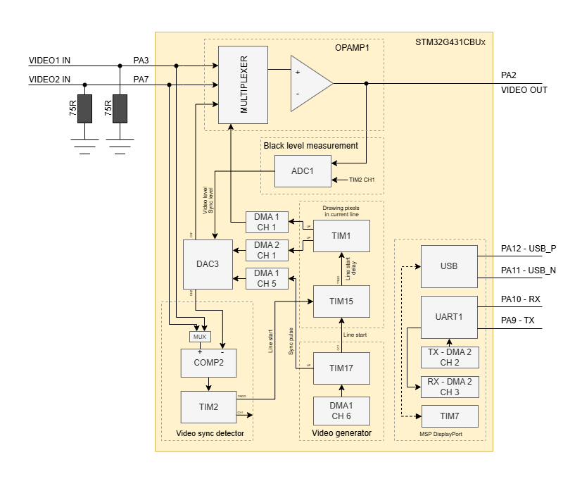

# OpenPixelOSD

OpenPixelOSD is an open-source project for generating and overlaying pixel graphics onto a video signal (OSD), based on the **STM32G431CBUx/** microcontroller.
The project aims to create a software monochrome On-Screen Display (OSD) for VPV to phase out the obsolete *MAX7456* chip which has been discontinued

OpenPixelOSD includes low-level drivers for the RTC6705 RF synthesizer and external power amplifier (SE5004L or similar).


### Safety/Legal Notice

The 5.8 GHz transmitter is subject to local regulations (power limits, parameters, certification requirements). Please ensure that the frequencies/power levels meet the requirements in your country.

## Repository Structure
```pgsql
.github/workflows/                   - CI build for STM32G431/G474
doc/                                 - diagrams and images
cmake/                               - toolchain & stm32 library CMake scripts
python/                              - helper scripts (font/logo conversion, font upload)
USB_Device/, Drivers/, Middlewares/  - STM32Cube generated code
src/                                 - firmware source (C code)
  main.c, main.h                     - program entry and shared definitions
  drivers/                           - peripherals, flash, LEDs, UART and USB
  video/                             - video generation, overlay and rendering
  settings/                          - persistent settings and OSD menu
  vtx/                               - transmitter and power-amplifier control
  msp/                               - MSP protocol, DisplayPort and flight controller
  fonts/, logo/                      - font handling and graphical assets
  stm32g4xx/                         - STM32 startup, interrupts and system support
  targets/                           - board-specific configuration
CMakeLists.txt                       - top‑level build file
```

#### Key Components

- `src/main.c` – program entry. Initializes hardware modules, then continually processes **MSP** messages and blinks an **LED**.

- `src/video/video_overlay.c` – core video overlay logic. Sets up **DACs**, timers and comparators to mix the generated OSD pixels with the incoming video signal.

- `src/msp/` – implements the **MultiWii Serial Protocol** (MSP) for interacting with flight controllers.

- `src/video/canvas_char.*` – double‑buffered character canvas used for text rendering onto the video overlay.

- `python/` – scripts to convert fonts or bitmaps into C arrays for embedding. For example, `convert_logo.py` reads an image, maps colors to 2‑bpp pixels, and outputs a header file. `font_updater.py` sends font data over serial using **MSP** commands.

#### Build and Continuous Integration

The GitHub workflow in `.github/workflows/build.yml` checks out the repo, installs the **Arm GNU toolchain**, builds the firmware for both MCU variants, and uploads the `.hex` and `.bin` artifacts.

#### What to Explore Next

* **Hardware setup** – Review `README.md` and the diagrams in `doc/` to understand signal routing and timing requirements.

* **Build system** – Read `CMakeLists.txt` and `cmake/` scripts to learn how the project is compiled and linked for different microcontrollers.

* **Video overlay internals** – Study `video_overlay.c` and `video_gen.c` to see how DMA and timers generate the analog video waveform.

* **MSP protocol** – Examine `src/msp/` to understand communication with flight controllers.

* **Python utilities** – The scripts in `python/` show how fonts and logos are converted to C data for flashing onto the device.

The project is licensed under GPL‑2.0, as noted in the LICENSE file. With these parts in mind, a newcomer can navigate the firmware, experiment with modifying fonts/logo data, and extend the OSD functionality.

*Important configuration options live in the main `CMakeLists.txt`. The `TARGET_MCU` variable switches between `STM32G431` and `STM32G474` builds. The `TARGET_BOARD` variable selects a board directory under `src/targets/` (default `GENERIC`).*

### Board targets

Each board lives in its own directory `src/targets/<TARGET_BOARD>/`:

* `target.h` – pin/resource defines plus, for a PA board, the PA bias/detector PID constants. Always on the include path; included via `#include "target.h"`.
* `target.c` – the VTX power table. Required for a VTX board.
* `target.cmake` – *optional* build-flag fragment, `include()`d automatically by `CMakeLists.txt`. Declares board properties:
  * `set(TARGET_USE_VTX TRUE)` – compile the RTC6705/VTX/PA source set + `target.c`, define `USE_VTX`.
  * `set(TARGET_USE_PA TRUE)` – define `USE_PA` (implies `TARGET_USE_VTX`).

  A board with no `target.cmake` is a plain OSD board.

Discovery is automatic: to add a board, create the directory with its `target.h` (plus `target.c` and `target.cmake` if it has a VTX/PA), then build with `-DTARGET_BOARD=<name>`. Nothing in `CMakeLists.txt` or the source tree needs editing. An unknown `TARGET_BOARD` fails configuration with a list of the available ones.

**VTX/PA is a property of the board, not a build variant.** `BUILD_VARIANT` now only carries the orthogonal options `NO_OSC`, `BLINKY`, `MCO`, `PA_DEBUG` (combine with `+`). `PA_DEBUG` compiles in the PA closed-loop OSD debug overlay (`debug_pa_loop()` and its field-edge trigger); it is off by default.

Current targets:

* `GENERIC` (OSD only)
* `GENERIC_VTX` (RTC6705, no PA)
* `GENERIC_VTX_PA`
* `GENERIC_VTX_PA_V2` (SE5004L-class linear external PA on the optimal `Cube/` pinout)
* `GENERIC_VTX_PA_RTC76401` (The RTC76401 works, but not recommend due to its frequency range and efficiency)

Example: `-DTARGET_BOARD=GENERIC_VTX -DBUILD_VARIANT=NO_OSC`.

## How It Works

### Hardware Architecture

- The **STM32G431CBUx/G474 microcontroller** handles control and pixel data generation.
- The input video signal is fed via **PA7** into the **OPAMP1 multiplexer**, operating in **follower mode**, and to the comparator positive input `vin+` **COMP2** for synchronization.
- **DAC3 Channel 2** is used as the negative reference `vref-` for the comparator.
- If no input video signal is present, **TIM17** generates the timing for the video signal.
- **TIM17** generates the sync pulses with **DMA1 Channel 5** and triggers the delay timer **TIM15** at line start. 
- Comparator **COMP2** is used for video signal "parsing" and line start detection.
- The output video signal is formed by mixing (fast switching) signals from the internal **DAC3 Channel 1** and the input video **PA7** via the built-in multiplexer.
- **TIM2** and **TIM15** provide precise synchronization for line and frame start:
  - **TIM2** track line start and trigger the delay timer **TIM15**.
  - **TIM1** is triggered by **TIM15** and handles pixel rendering in the line by transferring two buffers via **DMA1 Channel 1** and **DMA2 Channel 1**.
  - **DMA1 Channel 1** transfers the buffer containing precise timing information for switching the multiplexer connected to the OPAMP1 input.
  - **DMA2 Channel 1** transfers the buffer containing brightness values for each pixel to **DAC3 Channel 1** for pixel formation in the line.
  - **ADC1** is triggered by TIM2 and measures the black level of the video signal after the color burst. 

### Block Diagram


### Operating Principle

1. **Video Synchronization:** Comparators detect the start of a video line, enabling synchronization of rendering with the input signal.
2. **Timing:** Timers generate precise timing for the start of each pixel display in the line and manage DMA transactions for data transfer.
3. **Rendering:** The processor generates pixel data as a monochrome image with grayscale shades in buffers, which DMA then transfers to the DAC and OPAMP.
4. **Signal Formation:** Using the DAC and internal multiplexer OPAMP, the output video signal with the overlaid **OSD**.

### Reference for PAL/NTSC Standards

For detailed information on PAL and NTSC video standards, please refer to the comprehensive article by Martin Hinner:
https://martin.hinner.info/vga/pal.html

This resource provides authoritative timing diagrams, signal structures, and technical explanations essential for accurate video signal generation and processing.

# Key Features

- No external chips required for video signal detection and generation.
- Utilizes hardware timers and DMA to minimize CPU load.
- CCMRAM is used for fast access to critical data and code.
- Precise synchronization is supported via hardware comparators.
- Software scalability: real-time pixel rendering.
- Using the DAC to control pixel brightness.

# Color OSD


### How It Works

- **TIMER A**, **B**, and **C** of the **HRTIM** are used to generate the color carrier with a frequency of of 4.433 MHz for PAL and 3.579 MHz for NTSC. They all operate at the same frequency.
- **TIMER B** is synchronized with the color burst via comperator **COMP2**. **TIM3** ensures that the synchronization only occurs during the color burst. 
- **TIMER C** runs as a reference timer to determine the phase of the color burst in PAL mode for the current line (normal line or phase-alternated line).
- The output signal for the color carrier is generated by **TIMER A**. **TIMER A** generates a square wave signal at output **PA8**. 
- The phase shift of **TIMER A** is set via compare unit 1 of **TIMER B**. **TIMER B** CC1 is loaded via **DMA1 Channel 1** with the correct phase shift values ​​for the desired color of each pixel.
- The output signal at **PA8** is fed to the negative input of **OPAM1** via a voltage divider. **OPAMP1** operates in PGA mode with bias at the negative input. This modulates the color carrier onto the luminescence signal generated by **DAC3**.

### Hardware requirements

- For color OSD a STM32G474 is required.
- The use of a crystal as an external clock source is required.

### Block Diagram Color OSD


# RTC6705 & RF PA support

RTC6705 support
- 3-wire bit-bang interface (LSB-first, 25-bit)
- rtc6705_set_frequency(mhz) to program output frequency (e.g. 5865 MHz)
- rtc6705_set_power(level) to select internal PA power (3/7/11/13 dBm)
- rtc6705_smoketest() / detection API to verify chip presence

External PA control
- DAC1 OUT2 (PA5) → TLV9001 buffer → VREF of SE5004L
- ADC1 (PB11 / IN14) reads detector voltage (VDET)
- Additional ADC ranks: MCU temperature sensor & VREFINT for accurate scaling
- rf_pa_set_vref_mv() / rf_pa_get_vref_mv()
- rf_pa_read_vdet_mv() and rf_pa_estimate_pout_dbm() for telemetry

With these blocks you can build a simple FPV VTX:
RTC6705 generates the carrier, the internal PA provides a small boost, and the external PA (SE5004L etc.) delivers 100 mW–800 mW or more output.
Detector voltage is accessible for telemetry or closed-loop calibration.

## Connection and Setup

TODO:


### YouTube Video

[](https://youtu.be/GXBrZya5-nY)

## License

Open source software — see LICENSE in the repository.

---

# 🇺🇦 OpenPixelOSD 🇺🇦

OpenPixelOSD — це open-source проєкт для генерації та накладання піксельної графіки на відеосигнал (OSD), створений на базі **STM32G431CBUx**. 
Проєкт призначений для створення програмного монохромного On-Screen Display (OSD) для FPV, щоб відмовитися від застарілого чіпа *MAX7456*, який знятий з виробництва.

У OpenPixelOSD додано драйвери для RF синтезатора RTC6705 та зовнішнього підсилювача потужності (SE5004L чи аналогічного).

### Зауваження з безпеки/законодавства

Передавач на 5.8 ГГц підпадає під локальні регулювання (обмеження потужності, діапазон, вимоги до сертифікації). Переконайся, що частоти/рівні потужності відповідають вимогам у твоїй країні.


## Як це працює

### Архітектура апаратної частини

- **Мікроконтролер STM32G431CBUx/G474** відповідає за керування і генерацію піксельних даних.
- Вхідний відеосигнал подається на **вхід мультиплексора OPAMP1 - PA7** який працює в **follower** режимі та на вхід компаратора `vin+` **COMP3 - PA0** для синхронізації.
- В якості `vref-` для компаратора, використовується **DAC1 CH1**.
- Щоб не ускладнювати логіку детекції відео сигналу та формування власного відео сигналу - **TIM17** формує **еталонний відеосигнал** шляхом генерації **PWM** на піні **PB5** з підтримкою **черезрядкової** або **прогресивної** розгортки.
- Так як відсутній звʼязок для внутрішньої синхронізації **TIM17**, **DMA1 CH6** та **TIM1** для точної синхронізації початку рядка генерованого відео сигналу використовується **COMP4** під'єднаний через резистивний дільник 1:10 до входу `vin+` **COMP4** та входу **PA3** мультіплексора OPAMP1.
- Компаратори **COMP3** і **COMP4** використовуються для "парсингу" відеосигналу та детекції початку рядка.
- Відеосигнал на виході формується через змішування (швидке перемикання) вбудованим мультіплексором сигналів від **DAC3 CH1** та вхідного відео з **PA7** піна.
- **TIM2**, **TIM3** використовуються для точної синхронізації початку рядка і кадру.:
    - TIM2 і TIM3 відстежують початок лінії та відповідно запускають рендеринг пікселів.
    - TIM1 займається відтворенням пікселів у лінії шляхом передачі двох буферів до **DMA1 CH1** та **DMA1 CH2**.
    - DMA1 CH1 відповідає за передачу буфера який містить точний час коли саме треба перемкнути мультіплексор який під'єднаний до входу OPAMP1.
    - DMA1 CH2 відповідає за передачу буфера (який містить яскравість кожного пікселя) для DAC3 CH1 для формування пікселів в лінії.


### Принцип роботи

1. **Синхронізація відео:** Компаратори визначають момент початку рядка відео, що дозволяє синхронізувати рендеринг з вхідним сигналом.
2. **Таймінги:** Таймери формують точний час, коли починається відображення кожного пікселя в лінії та керують DMA-транзакціями для передачі даних.
3. **Рендеринг:** Процесор генерує піксельні дані у вигляді чорно-білого зображення з відтінками сірого у буферах, які потім DMA передає на DAC і OPAMP.
4. **Формування сигналу:** Використовуючи DAC і внутрішній мультіплексор OPAMP, формується відеосигнал з накладеним **OSD**.

## Основні особливості
- Відсутність зовнішніх мікросхем для детекції та формування відеосигналу.
- Використання апаратних таймерів і DMA для мінімізації навантаження на CPU.
- CCMRAM використовується для швидкого доступу до критичних даних і коду.
- Підтримка точної синхронізації за допомогою апаратних компараторів.
- Програмна масштабованість: рендеринг пікселів у реальному часі з можливістю накладання графіки.
- Використання DAC для керування яскравістю пікселів.

# Підтримка RTC6705 та RF PA
У OpenPixelOSD додано драйвери для RF синтезатора RTC6705 та зовнішнього підсилювача потужності (SE5004L чи аналогічного).

RTC6705
- 3-дротовий інтерфейс (25-біт, LSB-first)
- rtc6705_set_frequency(mhz) — програмування робочої частоти (наприклад 5865 МГц)
- rtc6705_set_power(level) — вибір рівня потужності внутрішнього PA (3/7/11/13 dBm)
- rtc6705_smoketest() / функція виявлення для перевірки чіпа

Керування зовнішнім PA
- DAC1 OUT2 (PA5) → TLV9001 → VREF підсилювача SE5004L
- ADC1 (PB11 / IN14) вимірює вихід детектора (VDET)
- Додаткові ранги: сенсор температури MCU та VREFINT для точного масштабування
- rf_pa_set_vref_mv() / rf_pa_get_vref_mv()
- rf_pa_read_vdet_mv() та rf_pa_estimate_pout_dbm() — для телеметрії

Таким чином можна побудувати FPV VTX, RTC6705 формує несучу, внутрішній PA підсилює її, а зовнішній PA (SE5004L) дає вихід 100–800 мВт або більше (залежно від підсилювача).
Напруга з детектора доступна для телеметрії або калібрування в замкненому циклі.

## Підключення та налаштування
TODO:

## Ліцензія

Відкрите програмне забезпечення — дивись LICENSE у репозиторії.

---
